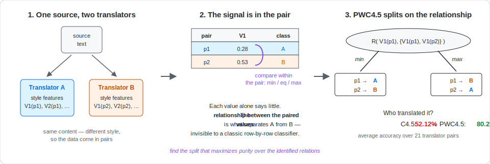

# PWC4.5 — Pairwise Comparative Classification (PWCCP)

[](https://github.com/Hebaelfiqi/PWC4.5/actions/workflows/build.yml)
[](https://github.com/Hebaelfiqi/PWC4.5/releases)
[](LICENSE)
[](data/LICENSE)
[](https://doi.org/10.1145/2898997)
[](https://doi.org/10.5281/zenodo.21134664)

Code and datasets for **PWC4.5**, a decision tree algorithm for
**Pair-Wise Comparative Classification Problems (PWCCP)**, extending C4.5 —
built for classification tasks where the signal lives in the *relationship
between paired instances* (e.g., which of two translators produced a given
translation) rather than in the attribute values themselves.



Traditional classifiers see each row independently and miss the pattern —
on translator identification, C4.5 averaged **52.12%** accuracy, no better
than a coin flip. PWC4.5 reads the data two rows at a time and splits on the
relationship inside each pair, reaching **80.23%** on the same task.
The [overview page](docs/01-pwccp-overview.md) walks through two worked
examples, and the [algorithm page](docs/02-pwc45-algorithm.md) shows the
framework and pseudocode.

Developed for the PhD research of Heba El-Fiqi (UNSW Canberra, 2013) with
Eleni Petraki and Hussein A. Abbass. This repository combines the original
source-code release with the documentation of the
[project website](https://sites.google.com/site/pairwiseccp/pwccp).
**If you use the code or datasets, please cite the publications
[below](#citing-this-work).**

## Quickstart

Requirements: a JDK (Java 7 or later; verified with Temurin 17). The only
library dependency, Apache Commons CLI, is bundled in `lib/cli.jar`.

```sh
git clone https://github.com/Hebaelfiqi/PWC4.5.git
cd PWC4.5
scripts/build.sh                      # javac -d bin -cp lib/cli.jar src/*.java
scripts/run_synthetic.sh 2d 1st_exp 0.0
```

Expected output — PWC4.5 prints the test-set accuracy:

```
2D_Noise_0.0         accuracy: 100.0%
```

and writes the learned tree and predictions next to the input data
(`Pruned_2D_Noise_0.0_decision_rules.txt`, `output_of_2D_Noise_0.0.csv`, …).
The learned tree is the pairwise XOR pattern the data was generated from:

```
R(V1(p1),{V1(p1),V1(p2)}) = min :
|     R(V2(p1),{V2(p1),V2(p2)}) = min : p1→+, p2→- (63.0/1.4)
|     R(V2(p1),{V2(p1),V2(p2)}) = max : p1→-, p2→+ (37.0/1.4)
R(V1(p1),{V1(p1),V1(p2)}) = max :
|     R(V2(p1),{V2(p1),V2(p2)}) = min : p1→-, p2→+ (39.0/1.4)
|     R(V2(p1),{V2(p1),V2(p2)}) = max : p1→+, p2→- (61.0/1.4)
```

Reproduce a translator-stylometry experiment (10 runs, published seeds):

```sh
scripts/run_translators.sh asad_daryabadi 1
```

Full manual and the exact published commands:
[docs/03-using-pwc45.md](docs/03-using-pwc45.md).

## What's in the repository

```
src/       Java source of PWC4.5 (entry point: PWC45)
lib/       Apache Commons CLI dependency (cli.jar)
scripts/   build.sh, run_synthetic.sh, run_translators.sh, convert_to_csv.py
data/      Datasets (C4.5 format, paired rows) — see data/README.md
           ├── 2d_data/, 5d_data/   synthetic XOR data:
           │        10 sampled experiments × 8 noise levels each
           └── translators_data/    21 translator pairs (7 Qur'an translators),
                    212 network-motif features, 10 experiments per pair
examples/  benchmark-data/ (dev/test CSVs, incl. classic UCI datasets)
           sample-output/  (what a run produces)
docs/      Documentation mirrored from the project website — start at
           docs/README.md
```

The datasets are documented in detail in [data/README.md](data/README.md) —
including the **pair encoding** (every two consecutive lines form one pair),
which you must preserve if you reuse the data. `scripts/convert_to_csv.py`
converts any dataset to CSV with explicit `pair_id`/`member` columns.

## Documentation

Start at [docs/README.md](docs/README.md). In reading order:
[PWCCP overview](docs/01-pwccp-overview.md) ·
[the PWC4.5 algorithm](docs/02-pwc45-algorithm.md) ·
[using PWC4.5](docs/03-using-pwc45.md) ·
[synthetic-data experiments & results](docs/04-artificial-data.md) ·
[translator stylometry & results](docs/05-translator-stylometry.md) ·
[authors](docs/06-authors.md).

## Source code map

| Class | Role |
|---|---|
| `PWC45` | Entry point: CLI parsing, data loading, experiment driver, evaluation |
| `Attribute` | Attribute handling and relationship-based split evaluation (gain ratio) |
| `Pair`, `Examples`, `Multiple_Variables` | Paired-instance data structures |
| `Node`, `Outcome`, `Tree_Branchs` | Decision tree structure and outcomes |
| `MaxBr_Estimation` | Estimation of possible branches for relationship splits (`-b`) |
| `Globals` | Global flags (pruning, etc.) |

## Licensing

- **Code**: [MIT License](LICENSE).
- **Datasets** (`data/`): [CC BY 4.0](data/LICENSE) — free to reuse with
  attribution; please cite the publications below.

## Citing this work

To cite the **software** itself, use the archived Zenodo record
(concept DOI, always resolves to the latest version):
[10.5281/zenodo.21134664](https://doi.org/10.5281/zenodo.21134664).

To cite the **method and results**, please cite the following publications
(chronological; the 2016 TALLIP article is the primary reference for the
PWC4.5 algorithm):

> Heba El-Fiqi, Eleni Petraki, and Hussein A. Abbass. 2011.
> **A computational linguistic approach for the identification of translator
> stylometry using Arabic-English text.**
> In *2011 IEEE International Conference on Fuzzy Systems (FUZZ-IEEE)*, 2039–2045.
> DOI: [10.1109/FUZZY.2011.6007535](https://doi.org/10.1109/FUZZY.2011.6007535)

> Heba El-Fiqi. 2013.
> **Detection of Translator Stylometry using Pair-wise Comparative
> Classification and Network Motif Mining.**
> PhD thesis, University of New South Wales, Canberra.
> DOI: [10.26190/unsworks/16460](https://doi.org/10.26190/unsworks/16460),
> handle: [1959.4/53020](http://hdl.handle.net/1959.4/53020)

> Heba El-Fiqi, Eleni Petraki, and Hussein A. Abbass. 2016.
> **Pairwise comparative classification for translator stylometric analysis.**
> *ACM Transactions on Asian and Low-Resource Language Information Processing*
> 16, 1, Article 2 (June 2016), 26 pages.
> DOI: [10.1145/2898997](https://doi.org/10.1145/2898997)

> Heba El-Fiqi, Eleni Petraki, and Hussein A. Abbass. 2019.
> **Network motifs for translator stylometry identification.**
> *PLOS ONE* 14, 2: e0211809.
> DOI: [10.1371/journal.pone.0211809](https://doi.org/10.1371/journal.pone.0211809)

```bibtex
@inproceedings{ElFiqi2011FuzzIEEE,
  author    = {El-Fiqi, Heba and Petraki, Eleni and Abbass, Hussein A.},
  title     = {A computational linguistic approach for the identification of translator stylometry using {Arabic}-{English} text},
  booktitle = {2011 IEEE International Conference on Fuzzy Systems (FUZZ-IEEE)},
  pages     = {2039--2045},
  year      = {2011},
  doi       = {10.1109/FUZZY.2011.6007535}
}

@phdthesis{ElFiqi2013Thesis,
  author = {El-Fiqi, Heba},
  title  = {Detection of Translator Stylometry using Pair-wise Comparative Classification and Network Motif Mining},
  school = {University of New South Wales, Canberra},
  year   = {2013},
  doi    = {10.26190/unsworks/16460},
  url    = {http://hdl.handle.net/1959.4/53020}
}

@article{ElFiqi2016PWC45,
  author    = {El-Fiqi, Heba and Petraki, Eleni and Abbass, Hussein A.},
  title     = {Pairwise Comparative Classification for Translator Stylometric Analysis},
  journal   = {ACM Transactions on Asian and Low-Resource Language Information Processing},
  volume    = {16},
  number    = {1},
  articleno = {2},
  numpages  = {26},
  month     = jun,
  year      = {2016},
  doi       = {10.1145/2898997}
}

@article{ElFiqi2019NetworkMotifs,
  author  = {El-Fiqi, Heba and Petraki, Eleni and Abbass, Hussein A.},
  title   = {Network motifs for translator stylometry identification},
  journal = {PLOS ONE},
  volume  = {14},
  number  = {2},
  pages   = {e0211809},
  year    = {2019},
  doi     = {10.1371/journal.pone.0211809}
}
```

## Authors

- **Dr. Heba El-Fiqi** — Senior Lecturer in Artificial Intelligence, UNSW Canberra
- **Assoc. Prof. Eleni Petraki** — Associate Professor, University of Canberra
- **Prof. Hussein Abbass** — Professor, UNSW Canberra

See [docs/06-authors.md](docs/06-authors.md) for bios and the
[project website](https://sites.google.com/site/pairwiseccp/pwccp) for the
original pages.
