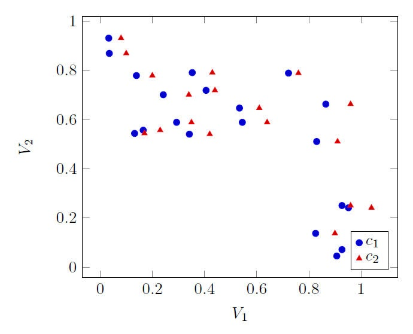
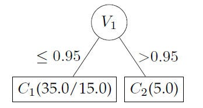
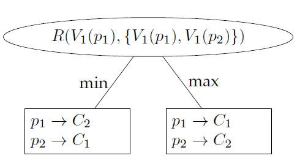
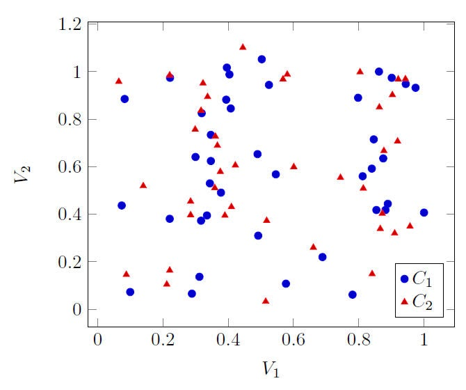
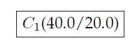
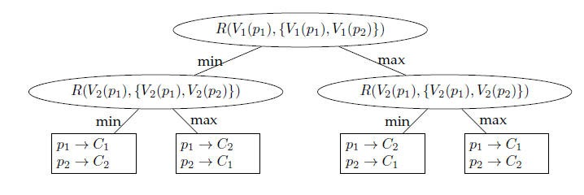

# PWCCP — Pairwise Comparative Classification Problems

> Corresponds to: ACM TALLIP 2016 article, Sections 1–3 (the examples appear
> as Figures 2–7 there); PhD thesis (2013). See
> [citations](../README.md#citing-this-work).

Comparative Classification Problems (CCP) are common in computational
forensics. In the pair-wise CCP (PWCCP), data are collected on two subjects.
The classification problem is to decide, given a piece of evidence, which of
the two subjects is responsible for it. CCP generalizes the problem to the
many-subjects case.

The key difference between PWCCP and traditional binary problems is that
hidden patterns can only be unmasked by comparing the instances as pairs.
Paired data sets contain repeated measurements of the same attribute, and the
changes in the values of the paired instances hold pertinent information for
the data mining process.

We modified the C4.5 decision tree classifier to manage PWCCP; we call this
new algorithm **PWC4.5**. We used PWC4.5 to address the problem of translator
stylometry identification of parallel translations, whereby different
translations are produced by different translators for the same original text.
Comparing translator detection using traditional classification against PWCCP:
traditional C4.5 failed to distinguish between different translators with an
average accuracy of **52.12%**, while PWC4.5 demonstrated a remarkable ability
to discriminate between translators with an average accuracy of **80.23%**.

## Example 1

A pair-wise relationship based on variable V1: V1 discriminates between the
two classes when instances are compared as pairs, but a traditional decision
tree cannot see it.

C4.5 splits on a value threshold and classifies poorly:

PWC4.5 detects the pairwise relationship and represents it directly:

## Example 2

A pair-wise relationship based on variables V1 **and** V2 (the XOR-like
two-variable case).

C4.5 fails entirely — it puts all instances into a single leaf:

PWC4.5 recovers the full relationship structure:

