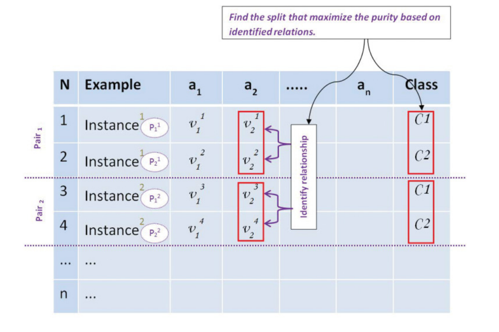
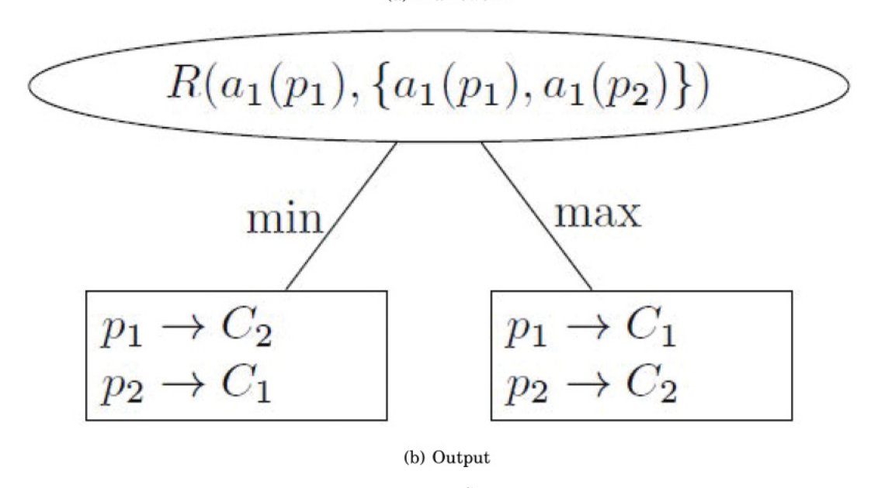
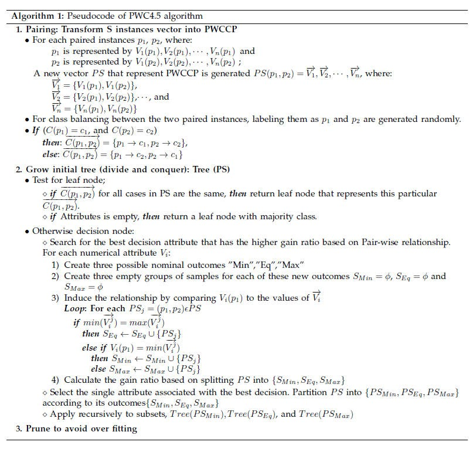

# PWC4.5 Decision Tree Algorithm

> Corresponds to: ACM TALLIP 2016 article, Section 4.1 and Algorithm 1;
> PhD thesis (2013). See [citations](../README.md#citing-this-work).
> Implementation: [`../src/`](../src/), entry point `PWC45.java`.

To uncover the hidden patterns or phenomena that may exist between each pair
of instances, we need to consider the values of the attributes for these
instances at the same time rather than working with each of them individually.
Numerical attributes may hold hidden information that can be seen by comparing
the values of each pair together. For example: we may find that ai(C1) is
usually the minimum of {a1(C1), a1(C2)} for any pair of instances, and this
relationship may occur regardless of the actual values of attribute ai. The
hidden pattern in this case is ai(C1) = min({a1(C1), a1(C2)}), or in our
notation:

```
R(ai(p1), {a1(p1), a1(p2)}) = min,  p1 → c1, p2 → c2
```

We need a special classifier that is able to capture the relationship between
the values of the same attribute for the two parallel translations. It should
be able to see the two instances as one pair that holds hidden information in
their relations to each other. As we need to capture the hidden pattern in the
relationship between the attribute values of the paired instance, we need to
evaluate this relationship. Thus, for each numerical attribute, rather than
using the traditional method of searching the best split point that C4.5 uses,
a new method of search is used. In this method, we consider the new vector
that holds information for the two items that represent a single pair. Values
of the evaluated attributes for both items are compared together to induce the
relationship. This relationship is used as a possible outcome for the
relationship condition. Then, gain ratio is calculated based on the new
outcomes. The attribute-based relationship that introduces the highest gain
ratio is selected as the best split attribute.

To solve this problem, we introduce PWC4.5, which is based on the C4.5
decision tree algorithm. We chose C4.5 as a well-known decision tree algorithm
that uses information gain ratio to nominate preferred attributes for building
the classifier.

## Framework

PWC4.5 targets the relationship between paired instances within one variable
at a time (Figure 1 of the TALLIP article): for each attribute, the values of
the two pair members are compared to induce a relationship (min / eq / max),
and the split that maximizes purity over these induced relations is chosen.



The resulting split node tests the relationship rather than a value
threshold, and each outcome assigns both members of the pair at once:



## Pseudocode

Pseudocode of the PWC4.5 algorithm:



- Source code: [`../src/`](../src/) — class map in the
  [repository README](../README.md#source-code-map)
- Manual: [Using PWC4.5](03-using-pwc45.md)
